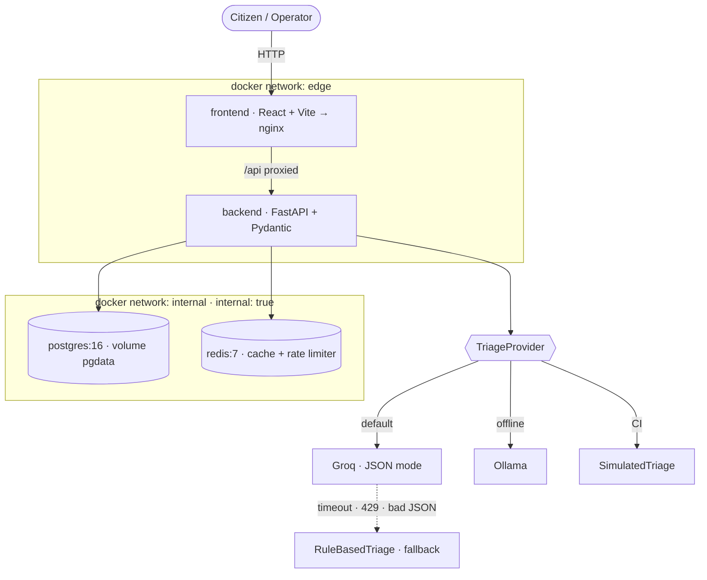
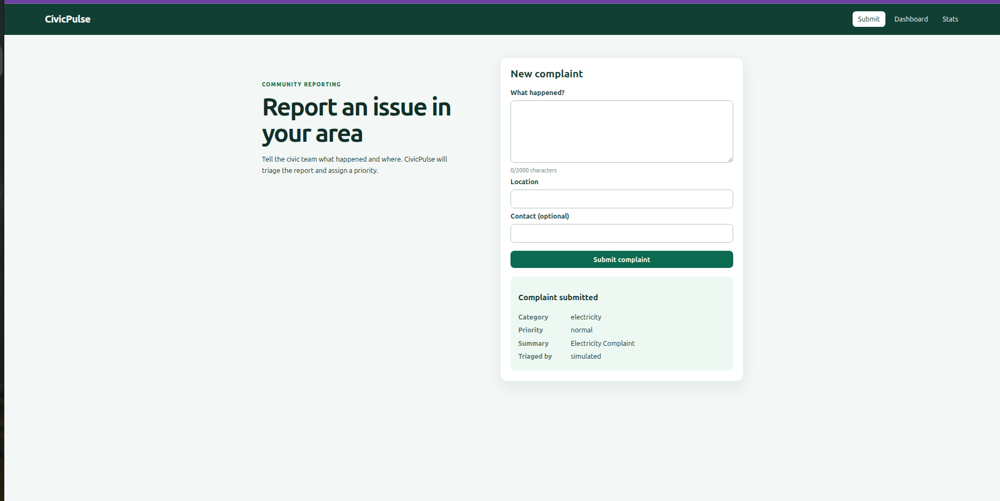
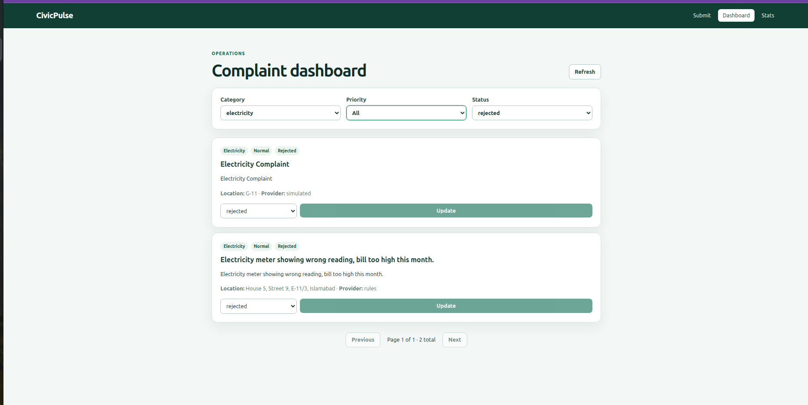
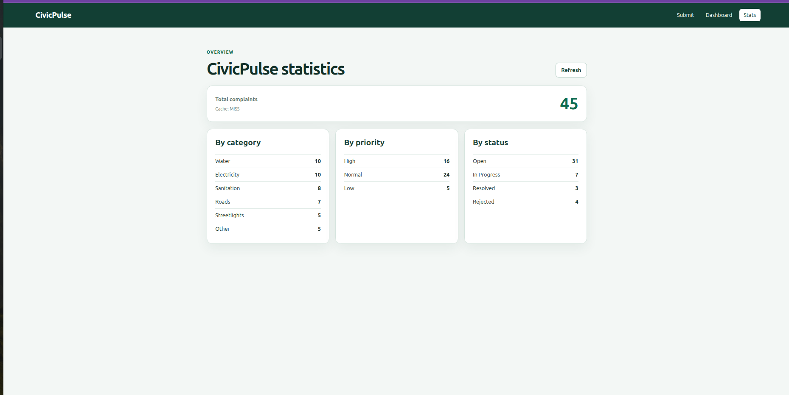
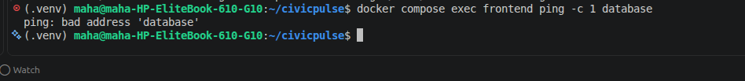
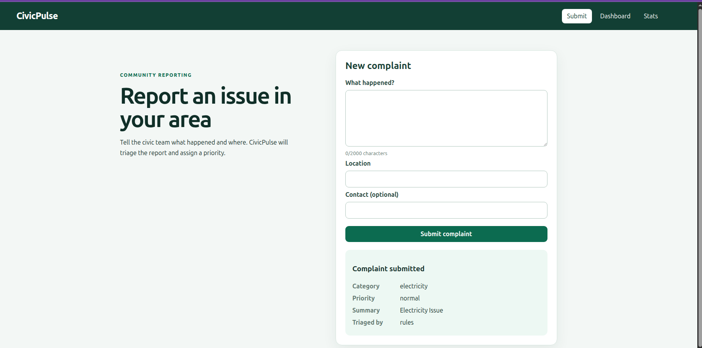

# CivicPulse


Municipal complaint intake, AI triage and operations dashboard.

## The problem

A citizen writes *"burst water main flooding Street 12 since fajr, water entering ground
floors"* into a form. In most municipalities that text lands in an unsorted queue behind
streetlight complaints. Dropdowns don't fix it: citizens pick the wrong category, pick
"Other" to get through the form, and can't judge urgency. The information is in the text.

CivicPulse reads it. Every complaint is triaged into a **category**, a **priority** and a
one-line **summary**, then shown on a live dashboard. The reader is replaceable — keyword
rules, a hosted LLM (Groq) or a local model (Ollama) — and the system keeps working when
the clever one is slow, rate-limited or wrong.

## Architecture



The frontend is on `edge` only and has no route to the database. The backend is the only
service on both networks.

## Quickstart

Requires Docker with Compose v2.

```bash
git clone https://github.com/ManahilAftab/civicpulse.git
cd civicpulse
cp .env.example .env
docker compose up --build
```

This starts Postgres, Redis, runs migrations, seeds 34 complaints and starts the API.

- API docs (Swagger): http://localhost:8000/docs
- Health: http://localhost:8000/health · Readiness: http://localhost:8000/ready

To use the Groq LLM, put your key in `.env` (`TRIAGE_PROVIDER=llm`, `GROQ_API_KEY=...`).
Without a key the system uses the rule-based triage.

## API

| Method | Path | Behaviour |
|---|---|---|
| POST | `/api/complaints` | Validate → triage → persist. 201 · 400 field errors · 429 + `Retry-After` |
| GET | `/api/complaints/{id}` | 200 · 404 |
| GET | `/api/complaints` | Filter by category, priority, status; `page`, `page_size ≤ 100`; returns `total` |
| PATCH | `/api/complaints/{id}/status` | State machine; invalid transition → 409 naming it |
| GET | `/api/stats` | Aggregates, Redis-cached 30 s, `X-Cache: HIT \| MISS` |
| GET | `/api/meta/providers` | Active provider, last 20 triage outcomes, cache hit rate |
| GET | `/health` | Liveness — never touches the database |
| GET | `/ready` | 200 if Postgres and Redis reachable; 503 naming the failed one |
| GET | `/metrics` | Prometheus text |

Full contract: [docs/API.md](docs/API.md).

## Screenshots

| Submit | Dashboard | Stats (X-Cache) |
|---|---|---|
|  |  |  |

**Network isolation:** the frontend cannot reach the database.



**Kubernetes:** all pods running in the `civicpulse` namespace.



## Repository

```
backend/   FastAPI app — routes/ services/ repositories/ providers/, Alembic, tests
frontend/  React + Vite + TypeScript, served by nginx
k8s/       Kustomize base + overlays
docs/      ADRs, engineering notes, runbook, API contract, AI usage
```

## Development

```bash
cd backend
python3 -m venv .venv && source .venv/bin/activate
pip install -r requirements-dev.txt
pytest                      # 73 tests, deterministic (TRIAGE_PROVIDER=simulated)
```

## Team

- **Manahil Aftab** — backend, AI triage layer, data, cache, Docker/Compose, Kubernetes, CI/CD, docs
- **Asifa Minahil** — frontend: Submit, Dashboard and Stats views

Backend framework: FastAPI. AI assistance is disclosed in [docs/AI-USAGE.md](docs/AI-USAGE.md).
